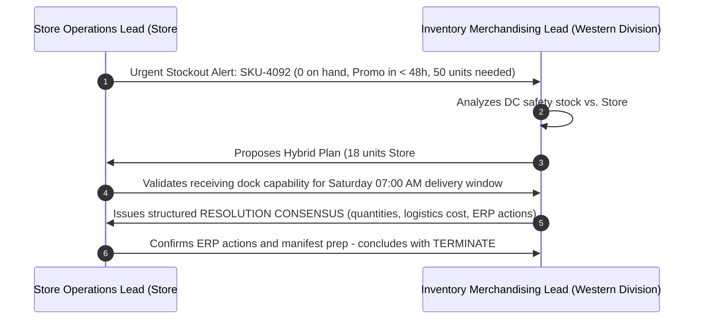

# Retail Multi-Agent Inventory Escalation System

An autonomous multi-agent retail orchestration system powered by **Microsoft AutoGen** (`pyautogen`) and **Google Gemini** models (`gemini-2.5-flash` / `gemini-2.5-pro`) interfacing through Google's OpenAI-compatible endpoint.

This system simulates autonomous negotiations between frontline store operations and corporate merchandise planning to dynamically resolve out-of-stock anomalies before high-stakes promotional events.

---

## 🏗️ Architecture & Interaction Flow

The escalation cycle features two autonomous agents negotiating across lead times, freight surcharges, stock availability, and margin preservation:



---

## 🤖 Agent Specifications

### 1. Store Operations Lead (`Store_Operations_Lead`)
- **Role**: Frontline Store Manager at Store #104 (Denver Downtown).
- **Core Focus**: On-shelf availability (OSA), avoiding POS walkaways, foot traffic capture, and floor set execution.
- **Tone**: Urgent, direct, and operational.
- **Trigger**: POS stockout anomaly on `SKU-4092` ("Premium Slim Stretch Denim - Vintage Wash", Size 32x32) with a promotional weekend starting in < 48 hours.

### 2. Inventory Merchandising Lead (`Inventory_Merchandising_Lead`)
- **Role**: Corporate Inventory Controller & Merchandise Planner for the Western Division.
- **Core Focus**: Open-to-Buy (OTB), gross margin retention, freight expediting costs, and weeks-of-supply (WOS) balance.
- **Tone**: Analytical, cost-conscious, and process-driven.
- **Levers Evaluated**:
  - **Sibling Store Transfer**: Store #109 has 18 units with excess 6.2 WOS (transfer viable via local courier in 12-24h).
  - **Regional DC Expedite**: Central DC has available stock; 24h courier delivery costs $4.50/unit ($144.00 total surcharge for 32 units).
  - **Standard Ground**: 72-hour lead time (rejected due to missing promotional window).
  - **Vendor Direct Drop-Ship (EDI 850)**: 5-7 days lead time (rejected).

---

## 📋 Standard Resolution Consensus Contract

When the agents reach mutual alignment, the Merchandising Lead produces the standardized operational consensus block:

```markdown
### 📋 RESOLUTION CONSENSUS: INVENTORY ESCALATION

* **Incident Summary**:
  * **Target SKU**: `SKU-4092` ("Premium Slim Stretch Denim - Vintage Wash", Size 32x32)
  * **Requesting Store**: Store #104 (Denver Downtown)
  * **Trigger**: 0 units on-hand; promotional weekend begins in < 48 hours.

* **Fulfillment Strategy & Stock Allocation**:
  * **Primary Action**: Intra-Store Transfer (Store #104 -> Store #109).
  * **Units Rebalanced**: 18 units (Store #109 excess WOS: 6.2).
  * **Secondary Action**: Expedited DC Emergency Pull (DC Central).
  * **Units Expedited**: 32 units via 24-hour courier service.
  * **Total Allocated**: 50 units (meets projected promotional sell-through).

* **Financial & Cost Impact**:
  * **Expedited Logistics Surcharge**: $144.00 ($4.50/unit courier rate).
  * **Gross Margin Preservation**: Projected revenue saved = $3,450.00; net promotional margin maintained at 52.4%.
  * **Human Approval Gate**: Bypassed (Total expedite cost < $25,000 threshold).

* **Action Items & ERP Execution**:
  * [x] **Store Ops**: Stage shelf space and prepare receiving manifest for Saturday 07:00 AM delivery.
  * [x] **Merchandising**: Generate EDI 856 advance shipping notice and update store transfer ticket #TR-9042 in ERP.
  * [x] **Procurement**: Close emergency escalation ticket.
```

---

## 🚀 Getting Started

### 1. Prerequisites
- Python 3.10+
- A Google Gemini API Key ([Get one here from Google AI Studio](https://aistudio.google.com/))

### 2. Environment Setup
Clone the repository and set up a virtual environment:

```bash
# Clone the repository
git clone https://github.com/mmxco/retail-agent-orchestrator.git
cd retail-agent-orchestrator

# Create and activate virtual environment
python -m venv .venv

# On Windows (PowerShell):
.\.venv\Scripts\Activate.ps1

# On Linux/macOS:
source .venv/bin/activate

# Install dependencies
pip install -r requirements.txt
```

### 3. Configure API Credentials
Copy the example environment file and insert your API key:

```bash
cp .env.example .env
```

Edit `.env`:
```ini
GEMINI_API_KEY="your-gemini-api-key-here"
GEMINI_MODEL="gemini-2.5-flash"
```

> **Note**: AutoGen routes requests through Google's OpenAI-compatible endpoint at `https://generativelanguage.googleapis.com/v1beta/openai/`.

### 4. Run the Simulation
Execute the escalation runner:

```bash
python run_simulation.py
```

---

## 📁 Repository Structure

```
retail-agent-orchestrator/
├── .env.example        # Environment variable template
├── .gitignore          # Git exclusion rules
├── README.md           # Project documentation and architecture guide
├── requirements.txt    # Project dependencies (pyautogen, python-dotenv)
├── config.py           # AutoGen LLM configuration for Google Gemini endpoint
├── agents.py           # ConversableAgent persona prompts and factory functions
└── run_simulation.py   # Multi-agent simulation runner
```

---

## 📄 License
MIT License. Free for retail engineering experimentation and research.
